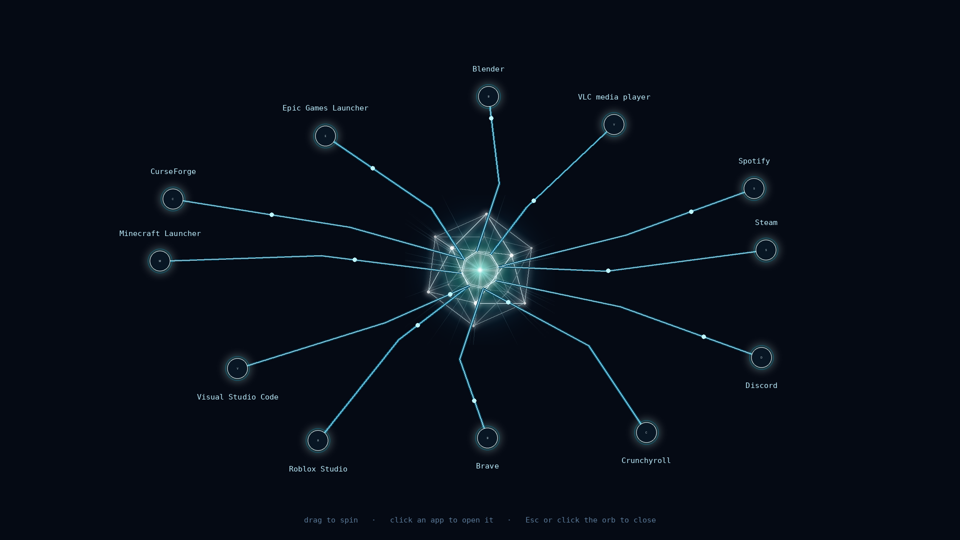
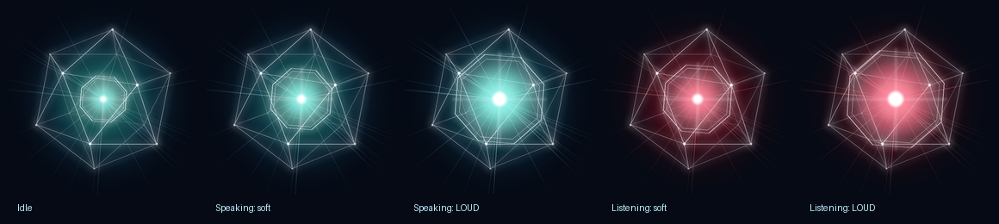

  

<h1 align="center">Great Sage</h1>

<i>"Answer. Great Sage is online. Awaiting your query, Master."</i>

A Jarvis-style personal AI for your Windows or Linux PC, inspired by the Great Sage from
*That Time I Got Reincarnated as a Slime* (Tensura). It lives in the corner of your desktop as a
glowing orb, listens for its name, talks back in a calm system voice, controls your PC, reads your
screen, and checks facts on the web instead of guessing.

Everything can run **locally on your own graphics card**, so it's free and private. Or you can switch it
to Claude for a smarter brain.

> Unofficial fan project. Not affiliated with or endorsed by the creators or publishers of Tensura.
> No artwork from the series is included; all visuals are original.

## Features

- **Speaks like the Great Sage.** Every reply starts with *Answer.*, *Report.*, *Notice.*, *Affirmative.* or
  *Suggestion,*. It calls you **"Master"** until you tell it otherwise ("call me Matt").
- **Suggestions.** Ask its opinion, or sound unsure, and it answers with "Suggestion, ..." plus
  its best recommendation. Ask it to do something when there's a better way, and it offers the alternative
  first ("Shall I do that instead?"). Say *yes* for its idea or *no* for yours. If it strongly disagrees,
  it asks *"Are you sure, Master?"* once, then does what you said. You can answer by voice without
  repeating the wake word.
- **Wake word.** Say *"Great Sage, open Spotify"* hands-free. Speech recognition runs entirely on your PC.
- **A living orb.** The glowing core and octagon swell with every syllable while it speaks or listens,
  bigger on loud words and smaller on soft ones. It turns red while it listens.
- **"Show me your mind."** The Sage glides to the center of your screen and glowing wires branch out to
  your apps: your pinned favorites, your most-used apps and a few random ones. The ring slowly orbits;
  drag it to spin it and click an app to open it.
- **Honest answers.** Factual questions are checked with a web search first, and it names its source. If
  it can't verify something, it says so instead of guessing.
- **Screen reading.** "What does this error mean?" It reads the live text of your active window (Windows), or
  looks at the screen with a vision model. An optional *Live screen* mode keeps it aware of what you're doing.
- **PC control.** Open apps, open websites, search files, run commands (it always asks you first) and
  check system stats.
- **Music and volume.** "Pause", "skip", "volume 30", "what song is this?". Works with Spotify,
  YouTube and most players.
- **Status report.** Time, local weather, CPU/GPU/RAM, what's playing and your next reminders.
- **Reminders, timers and alarms** that survive closing the app.
- **Memory.** Tell it things about you and it remembers them between sessions (stored locally in `memory.json`).
- **Desktop widget.** Sits in the upper-right corner (borderless on Windows), and shrinks to just the orb.
  Global shortcut: **Ctrl+Alt+;**
- **Say "goodbye"** and it signs off and closes itself.

## System requirements

Great Sage can think in two ways, and that decides what hardware you need:

- **Local mode (default):** the AI runs on your own graphics card through [Ollama](https://ollama.com).
  It's free and private, but it needs a decent GPU.
- **Claude mode:** the AI runs in the cloud with a Claude API key. It works on almost any PC, but costs a
  little per message and needs internet.

### Minimum

| | Windows | Linux |
|---|---|---|
| **Operating system** | Windows 10 22H2 (build 19045) or Windows 11 | 64-bit (x86_64): Ubuntu 22.04+, Fedora 39+, Arch or similar |
| **Python** | 3.10 or newer | 3.10 or newer (installed by `setup.sh`) |
| **CPU (Intel)** | 4 cores, 64-bit: Core i5 6th gen (e.g. i5-6500) or newer | same |
| **CPU (AMD)** | 4 cores, 64-bit: Ryzen 3 1200 or newer | same |
| **RAM** | 8 GB for Claude mode, 16 GB for local mode | same |
| **Storage** | 3 GB free for Claude mode, 15 GB free for local mode | same |
| **Extras** | Microphone and speakers for voice (optional); internet for fact-checks, weather and Claude | same |

**Graphics card for local mode (minimum).** This runs a small text-only model such as `qwen3:4b`
(set `ollama_model` in `config.json`). With a small model, "look at my screen" and other vision features
won't work.

| Brand | Minimum card | Notes |
|---|---|---|
| **NVIDIA** | GTX 1650 (4 GB) or any 4 GB+ card from the GTX 900 series on | Driver 551.61+ on Windows, 550+ on Linux |
| **AMD** | Radeon RX 6600 (8 GB) | Windows: RX 7600-7900 series via ROCm, older Radeons via Vulkan. Linux: RX 6800+ via ROCm v7, others via Vulkan |
| **Intel** | Arc A380 (6 GB) | Through Vulkan; still experimental in Ollama |
| **No GPU** | CPU only | Works with small models, but replies can take 10-60 seconds. Claude mode is a better fit. |

### Recommended

| | Recommended |
|---|---|
| **Operating system** | Windows 11 23H2 or newer, or a current Linux on an **X11** session (see the Linux notes below) |
| **CPU (Intel)** | Core i5-12400 / i7-12700 or newer (6+ cores) |
| **CPU (AMD)** | Ryzen 5 5600 / Ryzen 5 7600 or newer (6+ cores) |
| **RAM** | 32 GB (16 GB works) |
| **Storage** | 30 GB free on an SSD (room for bigger models) |

**Graphics card for the default model (`gemma4:12b`, which includes screen vision):**

| Brand | Recommended cards | Notes |
|---|---|---|
| **NVIDIA** | RTX 3060 12 GB, RTX 4060 Ti 16 GB, RTX 4070 / 4070 Super, RTX 5070 Ti or better | Best supported and fastest. 8 GB cards work but run slower. |
| **AMD** | RX 7700 XT, RX 7800 XT, RX 7900 XT/XTX, RX 9070 XT | Windows: ROCm covers the RX 7600-7900 series; newer cards use Vulkan. Linux: ROCm v7. |
| **Intel** | Arc B580 (12 GB), Arc A770 (16 GB) | Vulkan, experimental: works, but slower than NVIDIA/AMD |

These are estimates based on the model sizes and Ollama's published hardware support. Not every
configuration has been tested, so your results may vary.

## Install on Windows

1. Install [Python](https://www.python.org/downloads/) 3.10+ and tick **"Add python.exe to PATH"**.
2. Download this repository (green **Code** button, then **Download ZIP**) and unzip it somewhere permanent.
3. Double-click **`setup.bat`**. It installs the Python packages and Ollama, downloads the AI model
   (~8 GB, one time), and adds **Great Sage** shortcuts to your desktop and Start menu.
4. Open **Great Sage**. To pin it: Start menu, right-click Great Sage, then **Pin to taskbar**.

## Install on Linux

1. Download or clone this repository somewhere permanent.
2. In a terminal inside the folder, run **`bash setup.sh`**. It installs the system packages (it asks
   for your password), sets up Python in a private `.venv` folder, installs Ollama, downloads the model, and
   adds **Great Sage** to your app menu and desktop.
3. Open **Great Sage** from your app menu.

**Linux notes.** Most features work the same, with a few differences:

- **Exact window text reading** is Windows-only. On Linux the Sage looks at the screen with the vision model instead.
- **Ctrl+Alt+;** works on X11. On Wayland, add a custom shortcut in your system settings that runs the
  command `setup.sh` prints at the end (opening it again brings the running Sage forward).
- **Screen capture on Wayland** needs `grim` (Sway, Hyprland) or `gnome-screenshot`, and GNOME may ask permission.
- The Sage window keeps a normal title bar on Linux, because borderless windows can't reliably take typing there.
- Music control uses `playerctl`, volume uses `pactl`, and the voice uses `espeak-ng` (all installed by `setup.sh`).
- The "most-used apps" in the mind view come from apps you've opened through the Sage.
- Apps whose icon only exists as an SVG show their first letter instead.

## Android app (beta)

A phone version of the Great Sage, with the same orb, voice and personality. It can **replace Google's
assistant**: hold the power button and the Great Sage opens instead of Gemini.

- **Mixed brain:** when your phone is on the same Wi-Fi as your PC, it thinks with your PC's free local AI
  (and can control the PC: "pause the music on my PC", "PC status report"). Away from home, it switches
  to Claude (needs an API key).
- **On the phone:** open apps, open sites in Brave, timers, alarms, reminders, music and volume, calls and
  texts (you press call/send), status report (battery, weather, next alarm), memory, suggestions and
  fact-checked answers.
- Works on Android 8.0 or newer. iPhone isn't supported, because Apple doesn't allow replacing Siri.

**Install:**
1. Download **`GreatSage.apk`** from this repo's **Releases** page on your phone.
2. Open it and allow your browser to install apps when Android asks.
3. In the app, tap **⚙**:
   - **At home:** on your PC, say or type **"phone link"** to the Great Sage. Enter the PC address and
     pairing code it shows. The first time, Windows may ask to allow Python on **private networks**; click **Allow**.
   - **Away from home:** add a Claude API key.
4. Tap **Open assistant settings** and choose **Great Sage** as the *Digital assistant app*.
   On Samsung, also set *Side button, then Press and hold* to *Digital assistant*.

**Notes:**
- There's no always-on wake word on the phone. Android reserves the low-power "Hey Google" hardware
  for Google, so use the power button or tap the orb.
- When the Sage asks you a question ("Shall I do that instead?"), it listens for your answer automatically.
- The APK is built automatically by GitHub (`.github/workflows/android.yml`). It isn't on the Play Store,
  and none is needed.

## Things to say

| Say | What happens |
|---|---|
| "Great Sage, open Discord" | Opens the app |
| "Open YouTube" / "search for lofi beats" | Opens it in Brave |
| "Who won the last World Series?" | Searches the web, answers with a source |
| "Should I play Elden Ring or Minecraft tonight?" | "Suggestion, ..." |
| "Read this window" / "What's on my screen?" | Reads or looks at your screen |
| "Show me your mind" / "Close your mind" | The app constellation |
| "Status report" | Time, weather, PC stats, music, reminders |
| "Set a 10 minute timer for pizza" / "Wake me up at 7:30 am" | Saved timers and alarms |
| "Pause" / "Skip" / "Volume 40" / "What song is this?" | Media controls |
| "Remember that my favorite anime is Tensura" | Saves it to memory |
| "Call me Rimuru" | Changes what it calls you |
| "Goodbye" / "Bye, Great Sage" | Signs off and closes |

## Settings

`config.json` is created the first time you run it. Useful options:

| Setting | Default | What it does |
|---|---|---|
| `user_title` | `"Master"` | What the Sage calls you (`""` for nothing) |
| `provider` | `"ollama"` | `"ollama"` (local) or `"claude"` |
| `ollama_model` | `"gemma4:12b"` | Any Ollama model with tool support |
| `claude_api_key` | `""` | Your key from console.anthropic.com, for Claude mode |
| `hotkey` | `"ctrl+alt+;"` | Global show/hide shortcut |
| `mind_pinned` | Spotify, Steam, Discord, Crunchyroll, Brave | Apps that always appear in the mind view |
| `weather_location` | `""` (auto) | Town for the weather in status reports |
| `wake_word_enabled`, `verify_answers`, `live_screen_enabled` | | Also switchable in the app |

Want your own icon? Save a picture as `icon.png` in the folder and run `set_icon.bat`.

## Privacy

With the local brain, your conversations, voice, screen and memory never leave your PC. Web searches go
out only for fact-checking and the weather. Your personal files (`config.json`, `memory.json`,
`alarms.json`, `usage.json`) are listed in `.gitignore`. **Never upload `config.json`; it can hold your API key.**

**Phone link:** the PC only accepts phone connections from your home network, and only with the
6-digit pairing code. Turn it off with `"phone_link_enabled": false` in `config.json`.

## Disclaimer

Great Sage is free, open-source software provided **"as is", without warranty of any kind**. Running AI
models locally puts a heavy, sustained load on your graphics card, processor and memory. The Sage can
also open programs, change your volume and run commands on your PC (always with your confirmation).
**The authors and contributors, including the AI tools used to help build it, are not responsible for any
crashes, freezes, data loss, overheating, hardware damage or other harm** that may result from installing
or using it, including on overloaded or under-powered systems. Use it at your own risk. Keep your
drivers updated, make sure your PC is well cooled, and back up anything important.

## Credits and license

Created by **Matthew Dulisse** ([github.com/jokzwigtt](https://github.com/jokzwigtt)).
Built with the help of Claude by Anthropic.

Released under the [MIT License](LICENSE). You're free to use, change and repost this project, as long as
you keep the copyright and credit notice in the LICENSE file.
